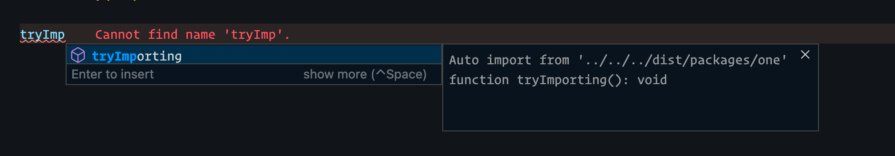
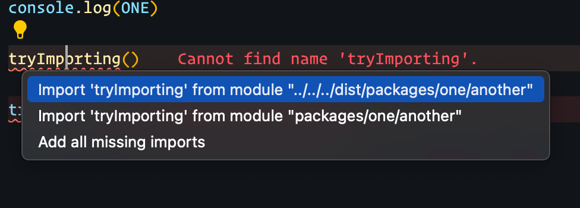

# Steps

- Open `src/packages/two/index.ts`
- Auto Import of `tryImporting` will be to dist as shown below

# Problem

When using `outDir`, auto imports will always resolve from the `outDir` rather than the source directory.  This causes auto imports to become incorrect.

## Image

### Failure One

- from ./src/packages/two/index.ts

### Failure Two

- from ./src/packages/two/index.ts

