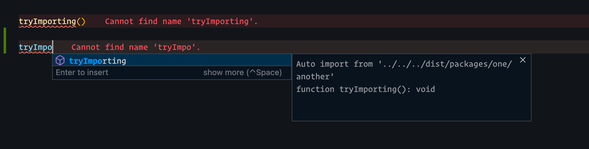

# Steps

- Open `src/packages/two/index.ts`
- Auto Import of `tryImporting` will be to dist as shown below

## Image

### Failure One

- from ./src/packages/two/index.ts

### Failure Two

- from ./src/packages/two/index.ts

